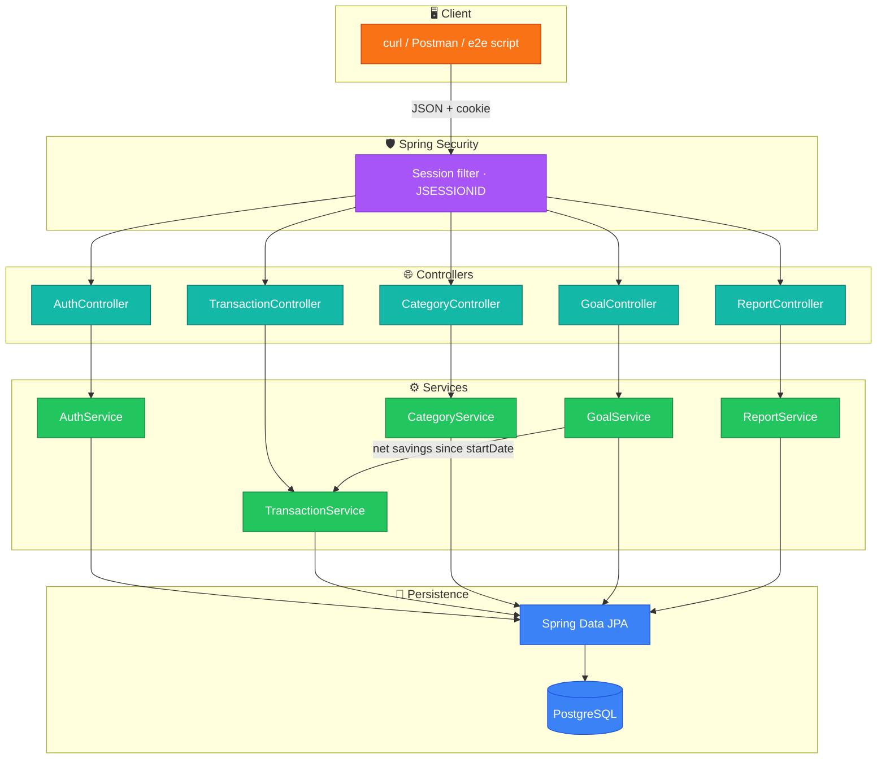
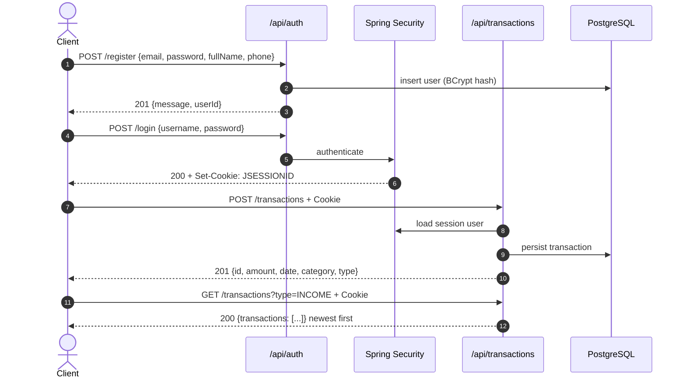
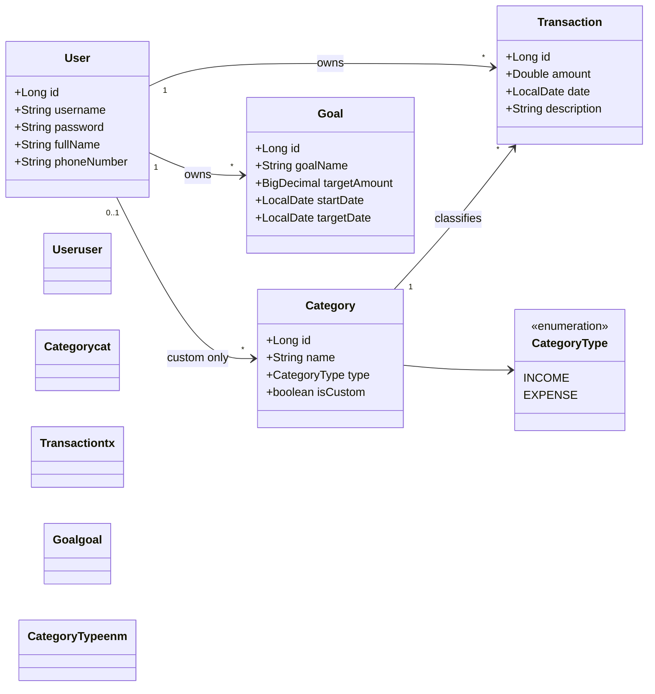
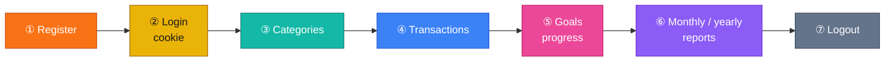

<p align="center">
  
</p>

<h1 align="center">Personal Finance Manager</h1>

<p align="center">
  <strong>Session-authenticated Spring Boot 3 API</strong> for income, expenses, savings goals, and reports.<br>
  Every resource is scoped to the logged-in user. Hard-deleted transactions never leak into goals or reports.
</p>

<p align="center">
  <a href="https://finance-management-system-sgft.onrender.com/api"></a>
  
  
  
  
  
</p>

<p align="center">
  <a href="#-live-api">Live API</a> ·
  <a href="#-what-this-project-needed">Requirements</a> ·
  <a href="#-architecture">Architecture</a> ·
  <a href="#-full-flow-how-to-hit-the-api">How to hit</a> ·
  <a href="#-api-reference">API</a> ·
  <a href="#-local-setup">Setup</a>
</p>

---

## 🌐 Live API

| | |
|---|---|
| **Base URL** | [`https://finance-management-system-sgft.onrender.com/api`](https://finance-management-system-sgft.onrender.com/api) |
| **Auth** | Cookie session (`JSESSIONID`) after `POST /auth/login` |
| **Public routes** | `POST /auth/register`, `POST /auth/login` |
| **Everything else** | Requires a valid session |

Render free instances can sleep. The first request after idle may take **30–60 seconds**.

Official e2e against production (Git Bash on Windows):

```bash
bash financial_manager_tests.sh https://finance-management-system-sgft.onrender.com/api
```

Last run: **86 / 86 passed (100%)**.

<p align="center">
  
</p>

---

## 🎯 What this project needed

Built to the Personal Finance Manager assignment: a **backend-only REST API** with cookie sessions (not JWT), user isolation, default categories, live goal progress, and reports that stay consistent after deletes.

### Functional requirements

| Area | What was required | How it is implemented |
|------|-------------------|------------------------|
| **Register / login / logout** | Email username, hashed password, session cookie | `POST /api/auth/*`, BCrypt, `JSESSIONID` |
| **Transactions** | Income & expense CRUD, filters, no future dates, amount > 0 | `/api/transactions` — **date cannot be changed** on update |
| **Categories** | Seeded defaults + user custom names | Defaults are global (`user_id` null) and **immutable** |
| **Goals** | Target amount/date, optional start date | `startDate` defaults to **today**; progress from net savings |
| **Reports** | Monthly + yearly, grouped by category | `GET /api/reports/monthly/{year}/{month}`, `.../yearly/{year}` |
| **Deletes** | Hard delete | Deleted rows **never** appear in goals or reports |
| **Isolation** | Users cannot see each other’s data | Queries always filter by authenticated user |
| **Errors** | Clear HTTP status + JSON | 400 / 401 / 403 / 404 / 409 via `@ControllerAdvice` |

### Default categories (seeded on startup)

| Name | Type | Editable? |
|------|------|-----------|
| Salary | `INCOME` | No (403 if you try to delete) |
| Food, Rent, Transportation, Entertainment, Healthcare, Utilities | `EXPENSE` | No |

Custom categories: unique per user. Cannot delete while a transaction still uses them (`400 Category is in use`).

### Business rules that graders check

- **Goal progress** = `max(0, income − expenses)` from `startDate` through today (inclusive of dated transactions in that window).
- **`progressPercentage`** capped at 100; **`remainingAmount`** never negative.
- **Target date** must be strictly in the future and not before start date.
- **Transaction date** is ISO `yyyy-MM-dd` and must not be in the future.
- **Zero net savings** serializes as JSON `0` (not `0.00`) so the official test script matches.

### Non-functional

| Need | Choice |
|------|--------|
| Java 17, Spring Boot 3 | `pom.xml` parent `3.2.4` |
| PostgreSQL in prod, H2 in tests | env vars + `src/test/resources` |
| Layered architecture | Controller → Service → Repository, DTOs not entities |
| Tests + coverage | JUnit 5, Mockito, JaCoCo **line coverage ≥ 80%** (build fails below) |
| Deployable | Docker + Render (`render.yaml`) |

### Out of scope

No SPA frontend — this is an HTTP JSON API. Hit it with **curl**, Postman, or `financial_manager_tests.sh`.

---

## 🧱 Tech stack

| Layer | Choice |
|-------|--------|
| Language | Java 17 |
| Framework | Spring Boot 3.2.4 (Web, Validation, Security, Data JPA) |
| Auth | Session cookies (`IF_REQUIRED`), CSRF off for API clients |
| DB | PostgreSQL 15 (prod) · H2 (tests) |
| JSON | Jackson + custom double formatting for zeros |
| Build | Maven Wrapper / Maven 3.9 |
| Containers | Multi-stage Dockerfile (Temurin 17) + Compose |
| Hosting | Render Web Service + Render PostgreSQL |

---

## 🏗 Architecture

<p align="center">
  
</p>



### Design decisions

- **Cookie sessions, not JWT** — the assignment requires `JSESSIONID`.
- **Hard delete** — no soft-delete flag; reports and goals recompute from remaining rows.
- **Default categories are global** — `user_id` is null so every account shares the same immutable set.
- **DTOs at the edge** — JPA entities never leave the service layer.
- **`@ControllerAdvice`** — domain exceptions map to 400 / 401 / 403 / 404 / 409.

### Request path (auth + transaction)



---

## 🧩 Domain model (UML)



---

## 🚀 Full flow — how to hit the API

Use a **cookie jar**. Without it, protected calls return `401`.

Set the base once (live or local):

```bash
export BASE=https://finance-management-system-sgft.onrender.com/api
# export BASE=http://localhost:8080/api
```

Windows Git Bash: same commands. PowerShell: use `curl.exe` (not the `Invoke-WebRequest` alias).

<p align="center">
  
</p>

### 1. Register

```bash
curl -sS -X POST "$BASE/auth/register" \
  -H "Content-Type: application/json" \
  -d '{
    "username": "alex@example.com",
    "password": "password123",
    "fullName": "Alex Rivera",
    "phoneNumber": "+15551234567"
  }'
```

**201**

```json
{"message":"User registered successfully","userId":1}
```

Duplicate email → **409** `Username already exists`. Missing fields → **400** (Bean Validation).

### 2. Login (saves the session)

```bash
curl -sS -c cookies.txt -X POST "$BASE/auth/login" \
  -H "Content-Type: application/json" \
  -d '{"username":"alex@example.com","password":"password123"}'
```

**200** `{"message":"Login successful"}` plus `Set-Cookie: JSESSIONID=...`

Wrong password → **401** `Bad credentials`.

### 3. Categories

```bash
curl -sS -b cookies.txt "$BASE/categories"
```

**200** — defaults plus any custom categories you created.

```bash
curl -sS -b cookies.txt -X POST "$BASE/categories" \
  -H "Content-Type: application/json" \
  -d '{"name":"Freelance","type":"INCOME"}'
```

**201** `{"name":"Freelance","type":"INCOME","custom":true}`

```bash
curl -sS -b cookies.txt -X DELETE "$BASE/categories/Freelance"
```

**200** if unused. **400** if in use. **403** if it is a default name.

### 4. Transactions

<p align="center">
  
</p>

```bash
# Income
curl -sS -b cookies.txt -X POST "$BASE/transactions" \
  -H "Content-Type: application/json" \
  -d '{
    "amount": 5000.00,
    "date": "2024-01-15",
    "category": "Salary",
    "description": "January salary"
  }'

# Expense
curl -sS -b cookies.txt -X POST "$BASE/transactions" \
  -H "Content-Type: application/json" \
  -d '{
    "amount": 1200.00,
    "date": "2024-01-16",
    "category": "Rent",
    "description": "Monthly rent"
  }'
```

**201** — `type` is inferred from the category (`INCOME` / `EXPENSE`).

List (newest first). Optional filters: `startDate`, `endDate`, `category`, `categoryId`, `type`.

```bash
curl -sS -b cookies.txt "$BASE/transactions"
curl -sS -b cookies.txt "$BASE/transactions?category=Salary"
curl -sS -b cookies.txt "$BASE/transactions?startDate=2024-01-01&endDate=2024-01-31&type=EXPENSE"
```

Update — **date in the body is ignored**; the original date stays.

```bash
curl -sS -b cookies.txt -X PUT "$BASE/transactions/1" \
  -H "Content-Type: application/json" \
  -d '{"amount":5500.00,"description":"Salary plus bonus","date":"2099-01-01"}'
```

```bash
curl -sS -b cookies.txt -X DELETE "$BASE/transactions/2"
```

**200** `{"message":"Transaction deleted successfully"}` · missing id → **404**.

Rejected creates: unknown category, future date, amount ≤ 0, bad date format → **400**.

### 5. Savings goals

Progress is live net savings from `startDate` (default: today) through now.

```bash
curl -sS -b cookies.txt -X POST "$BASE/goals" \
  -H "Content-Type: application/json" \
  -d '{
    "goalName": "Emergency Fund",
    "targetAmount": 10000.00,
    "targetDate": "2027-01-01",
    "startDate": "2024-01-01"
  }'
```

**201** includes `currentProgress`, `progressPercentage`, `remainingAmount`.

```bash
curl -sS -b cookies.txt "$BASE/goals"
curl -sS -b cookies.txt "$BASE/goals/1"

curl -sS -b cookies.txt -X PUT "$BASE/goals/1" \
  -H "Content-Type: application/json" \
  -d '{"targetAmount":15000.00,"targetDate":"2028-01-01"}'

curl -sS -b cookies.txt -X DELETE "$BASE/goals/1"
```

Another user’s goal → **403** `Cannot access this goal`.

### 6. Reports

<p align="center">
  
</p>

```bash
curl -sS -b cookies.txt "$BASE/reports/monthly/2024/1"
curl -sS -b cookies.txt "$BASE/reports/yearly/2024"
```

Example monthly payload:

```json
{
  "month": 1,
  "year": 2024,
  "totalIncome": { "Salary": 5500.00 },
  "totalExpenses": { "Rent": 1200.00, "Food": 400.00 },
  "netSavings": 3900.00
}
```

Empty month/year still **200** with empty maps and `"netSavings": 0`. Month `0` or `13` → **400**.

### 7. Logout

```bash
curl -sS -b cookies.txt -c cookies.txt -X POST "$BASE/auth/logout"
```

**200** `{"message":"Logout successful"}`. Next protected call → **401**.

### Happy-path map



---

## 📡 API reference

All paths are under `/api`. Send `Content-Type: application/json` on POST/PUT.

### Auth

| Method | Path | Auth | Status |
|--------|------|------|--------|
| POST | `/auth/register` | No | 201, 400, 409 |
| POST | `/auth/login` | No | 200 + cookie, 401 |
| POST | `/auth/logout` | Yes | 200, 401 |

Register body:

```json
{
  "username": "user@example.com",
  "password": "password123",
  "fullName": "John Doe",
  "phoneNumber": "+1234567890"
}
```

`username` must be a valid **email**.

### Transactions

| Method | Path | Notes |
|--------|------|--------|
| POST | `/transactions` | Amount > 0, date not in the future, category must exist |
| GET | `/transactions` | Newest first. Query: `startDate`, `endDate`, `category`, `categoryId`, `type` |
| PUT | `/transactions/{id}` | Amount / description / category; **date is immutable** |
| DELETE | `/transactions/{id}` | Permanent |

### Categories

| Method | Path |
|--------|------|
| GET | `/categories` |
| POST | `/categories` body `{ "name", "type": "INCOME" \| "EXPENSE" }` |
| DELETE | `/categories/{name}` |

### Goals

| Method | Path |
|--------|------|
| POST | `/goals` |
| GET | `/goals` |
| GET | `/goals/{id}` |
| PUT | `/goals/{id}` |
| DELETE | `/goals/{id}` |

Create body:

```json
{
  "goalName": "Vacation Fund",
  "targetAmount": 5000.00,
  "targetDate": "2027-12-01",
  "startDate": "2024-02-01"
}
```

### Reports

| Method | Path |
|--------|------|
| GET | `/reports/monthly/{year}/{month}` |
| GET | `/reports/yearly/{year}` |

### Error contract

| Code | When |
|------|------|
| **400** | Validation, bad dates, amount ≤ 0, category in use, unknown category |
| **401** | No session, bad credentials, after logout |
| **403** | Default category delete, another user’s goal |
| **404** | Missing transaction / category / goal (or another user’s transaction treated as missing) |
| **409** | Duplicate username or duplicate custom category name |

---

## 💻 Local setup

### Prerequisites

- JDK **17+**
- Maven **3.9+** (or `./mvnw`)
- PostgreSQL **15+** or Docker

### Database

```bash
docker compose up db -d
```

Compose DB password is `password`. Local defaults without Compose:

```
SPRING_DATASOURCE_URL=jdbc:postgresql://localhost:5432/finance_manager
SPRING_DATASOURCE_USERNAME=postgres
SPRING_DATASOURCE_PASSWORD=postgres
```

Create database `finance_manager` if you are not using Compose.

### Run

```bash
mvn spring-boot:run
```

API: [http://localhost:8080/api](http://localhost:8080/api)

Full stack (app + Postgres):

```bash
docker compose up --build
```

### Tests and coverage

```bash
mvn test
```

JaCoCo report: `target/site/jacoco/index.html`. The build **fails** if line coverage is under 80%.

Local e2e (app must be running):

```bash
bash financial_manager_tests.sh http://localhost:8080/api
```

---

## ☁️ Deploy on Render

Live instance: [finance-management-system-sgft.onrender.com](https://finance-management-system-sgft.onrender.com/api)

1. Push the repo to GitHub.
2. Create a **PostgreSQL** database on Render.
3. Create a **Web Service** from the repo (Docker runtime, or `render.yaml`).
4. Set:
   - `SPRING_DATASOURCE_URL` — JDBC form `jdbc:postgresql://HOST:PORT/DB` (convert from `postgres://` if Render gives a URL scheme)
   - `SPRING_DATASOURCE_USERNAME`
   - `SPRING_DATASOURCE_PASSWORD`
5. Build: `./mvnw clean package -DskipTests` (or Docker image from the Dockerfile)
6. Start: `java -jar target/finance-manager-0.0.1-SNAPSHOT.jar`

---

## 📁 Project layout

```
src/main/java/com/syfe/financemanager/
  controller/    REST endpoints
  service/       business rules (progress, reports, validation)
  repository/    Spring Data JPA
  dto/           request / response payloads
  model/         User, Transaction, Category, Goal
  security/      session filter chain, UserDetails
  exception/     @ControllerAdvice
  config/        Jackson number formatting
docs/screenshots/
financial_manager_tests.sh
docker-compose.yml
Dockerfile
render.yaml
```

---

<p align="center">
  <sub>Personal Finance Manager · Spring Boot 3 · cookie sessions · PostgreSQL</sub>
</p>
