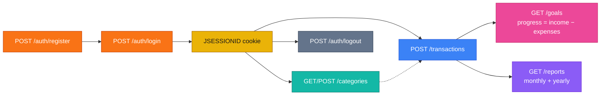

# Personal Finance Manager

Spring Boot 3 REST API for income, expenses, savings goals, and reports. Session cookie auth (`JSESSIONID`). Every resource is scoped to the logged-in user.

**Live:** [https://finance-management-system-sgft.onrender.com/api](https://finance-management-system-sgft.onrender.com/api)

> Render free tier sleeps. First request after idle can take 30–60s.

```bash
bash financial_manager_tests.sh https://finance-management-system-sgft.onrender.com/api
```

Last run against live: **86 / 86 passed**.

Java 17 · Spring Boot 3.2.4 · PostgreSQL · JaCoCo ≥ 80%

---

## What this project needed

Backend-only assignment. Cookie sessions (not JWT). No frontend.

| Requirement | Rule |
|-------------|------|
| Auth | Register (email username), login, logout. BCrypt. `JSESSIONID` |
| Transactions | CRUD, amount > 0, no future dates. **Date cannot change** on update |
| Categories | Seeded defaults (immutable) + custom per user |
| Goals | Target amount/date. `startDate` defaults to today |
| Goal progress | `max(0, income − expenses)` from `startDate` through today |
| Reports | Monthly and yearly, grouped by category |
| Deletes | Hard delete — gone from goals and reports |
| Isolation | Users cannot see each other’s data |
| Errors | 400 / 401 / 403 / 404 / 409 |
| Tests | JUnit + Mockito, line coverage **≥ 80%** |

**Defaults (cannot edit/delete):** Salary (`INCOME`); Food, Rent, Transportation, Entertainment, Healthcare, Utilities (`EXPENSE`). Custom names unique per user. In-use category cannot be deleted.

Zero `netSavings` / `currentProgress` is JSON `0` (not `0.00`) so the official test script matches.

---

## How to hit the API

Cookie jar is required after login. Without it, protected routes return `401`.




PowerShell: use `curl.exe`. Git Bash: `curl` as below.

```bash
export BASE=https://finance-management-system-sgft.onrender.com/api
# export BASE=http://localhost:8080/api
```

### 1. Register

```bash
curl -sS -X POST "$BASE/auth/register" \
  -H "Content-Type: application/json" \
  -d '{
    "username": "alex@example.com",
    "password": "password123",
    "fullName": "Alex Rivera",
    "phoneNumber": "+15551234567"
  }'
```

`201` `{"message":"User registered successfully","userId":1}` · duplicate email `409` · missing fields `400`

### 2. Login

```bash
curl -sS -c cookies.txt -X POST "$BASE/auth/login" \
  -H "Content-Type: application/json" \
  -d '{"username":"alex@example.com","password":"password123"}'
```

`200` + `Set-Cookie: JSESSIONID` · bad password `401`

### 3. Categories

```bash
curl -sS -b cookies.txt "$BASE/categories"

curl -sS -b cookies.txt -X POST "$BASE/categories" \
  -H "Content-Type: application/json" \
  -d '{"name":"Freelance","type":"INCOME"}'

curl -sS -b cookies.txt -X DELETE "$BASE/categories/Freelance"
```

In use → `400`. Default name → `403`.

### 4. Transactions

```bash
curl -sS -b cookies.txt -X POST "$BASE/transactions" \
  -H "Content-Type: application/json" \
  -d '{"amount":5000.00,"date":"2024-01-15","category":"Salary","description":"January salary"}'

curl -sS -b cookies.txt -X POST "$BASE/transactions" \
  -H "Content-Type: application/json" \
  -d '{"amount":1200.00,"date":"2024-01-16","category":"Rent","description":"Monthly rent"}'

curl -sS -b cookies.txt "$BASE/transactions"
curl -sS -b cookies.txt "$BASE/transactions?category=Salary"
curl -sS -b cookies.txt "$BASE/transactions?startDate=2024-01-01&endDate=2024-01-31&type=EXPENSE"

# Date in the body is ignored
curl -sS -b cookies.txt -X PUT "$BASE/transactions/1" \
  -H "Content-Type: application/json" \
  -d '{"amount":5500.00,"description":"Salary plus bonus"}'

curl -sS -b cookies.txt -X DELETE "$BASE/transactions/2"
```

`type` comes from the category. List is newest first. Unknown category / future date / amount ≤ 0 → `400`.

### 5. Goals

```bash
curl -sS -b cookies.txt -X POST "$BASE/goals" \
  -H "Content-Type: application/json" \
  -d '{"goalName":"Emergency Fund","targetAmount":10000.00,"targetDate":"2027-01-01","startDate":"2024-01-01"}'

curl -sS -b cookies.txt "$BASE/goals"
curl -sS -b cookies.txt "$BASE/goals/1"

curl -sS -b cookies.txt -X PUT "$BASE/goals/1" \
  -H "Content-Type: application/json" \
  -d '{"targetAmount":15000.00,"targetDate":"2028-01-01"}'

curl -sS -b cookies.txt -X DELETE "$BASE/goals/1"
```

Response includes `currentProgress`, `progressPercentage`, `remainingAmount`. Another user’s goal → `403`.

### 6. Reports

```bash
curl -sS -b cookies.txt "$BASE/reports/monthly/2024/1"
curl -sS -b cookies.txt "$BASE/reports/yearly/2024"
```

```json
{
  "month": 1,
  "year": 2024,
  "totalIncome": { "Salary": 5500.00 },
  "totalExpenses": { "Rent": 1200.00 },
  "netSavings": 4300.00
}
```

Empty period is still `200` with `"netSavings": 0`. Month `0` or `13` → `400`.

### 7. Logout

```bash
curl -sS -b cookies.txt -c cookies.txt -X POST "$BASE/auth/logout"
```

`200` then protected calls → `401`.

---

## API

Base path `/api`. POST/PUT: `Content-Type: application/json`.

| Method | Path | Auth |
|--------|------|------|
| POST | `/auth/register` | no |
| POST | `/auth/login` | no |
| POST | `/auth/logout` | yes |
| GET/POST | `/categories` | yes |
| DELETE | `/categories/{name}` | yes |
| GET/POST | `/transactions` | yes |
| PUT/DELETE | `/transactions/{id}` | yes |
| GET/POST | `/goals` | yes |
| GET/PUT/DELETE | `/goals/{id}` | yes |
| GET | `/reports/monthly/{year}/{month}` | yes |
| GET | `/reports/yearly/{year}` | yes |

Transaction filters: `startDate`, `endDate`, `category`, `categoryId`, `type`.

| Code | Meaning |
|------|---------|
| 400 | Validation, bad date, amount ≤ 0, category in use |
| 401 | No session / bad credentials |
| 403 | Default category delete / another user’s goal |
| 404 | Missing resource (or another user’s transaction) |
| 409 | Duplicate username or custom category |

---

## Stack

Controller → Service → Repository. DTOs at the edge, entities stay internal. `@ControllerAdvice` maps domain errors.

| | |
|--|--|
| Auth | Spring Security session cookies |
| DB | PostgreSQL 15 (prod), H2 (tests) |
| Build | Maven |
| Deploy | Docker + Render |

---

## Local setup

JDK 17+, Maven 3.9+, PostgreSQL 15+ (or Docker).

```bash
docker compose up db -d
mvn spring-boot:run
```

Local API: http://localhost:8080/api

```
SPRING_DATASOURCE_URL=jdbc:postgresql://localhost:5432/finance_manager
SPRING_DATASOURCE_USERNAME=postgres
SPRING_DATASOURCE_PASSWORD=postgres
```

Compose DB password is `password`. App + DB: `docker compose up --build`.

```bash
mvn test
bash financial_manager_tests.sh http://localhost:8080/api
```

Coverage: `target/site/jacoco/index.html`. Build fails under 80% line coverage.

---

## Render

1. Create PostgreSQL + Web Service from this repo.
2. Set `SPRING_DATASOURCE_URL` (`jdbc:postgresql://HOST:PORT/DB`), `SPRING_DATASOURCE_USERNAME`, `SPRING_DATASOURCE_PASSWORD`.
3. Build: `./mvnw clean package -DskipTests` · Start: `java -jar target/finance-manager-0.0.1-SNAPSHOT.jar`

`render.yaml` is in the repo.

---

## Layout

```
src/main/java/com/syfe/financemanager/
  controller/   REST
  service/      rules
  repository/   JPA
  dto/          payloads
  model/        entities
  security/     session auth
  exception/    @ControllerAdvice
  config/       Jackson zeros
```
